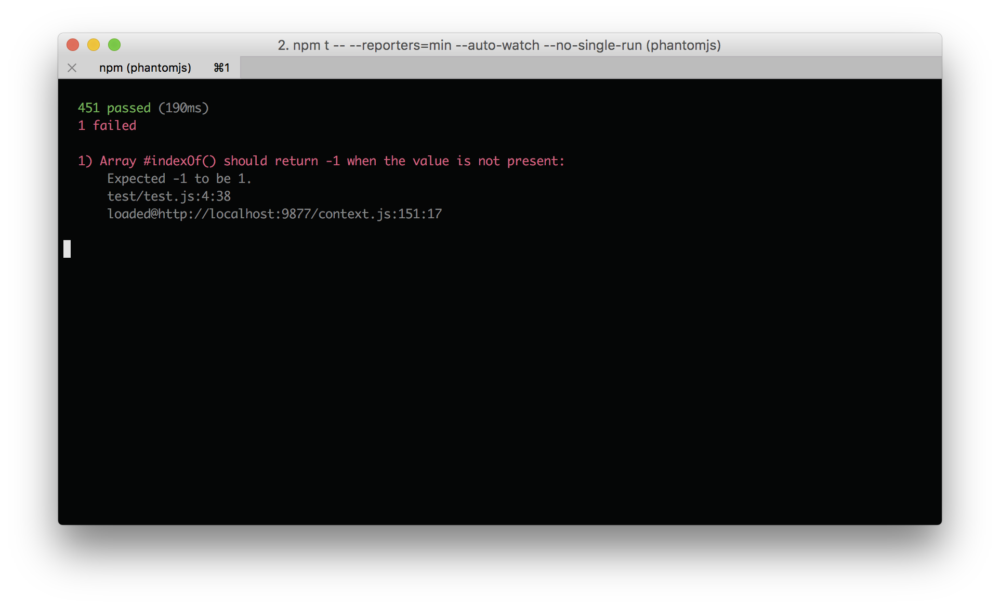

# karma-min-reporter

Minimal [Karma][] test reporter that mimics mocha's min reporter.

[![npm Version][npm-badge]][npm]
[![Build Status][build-badge]][build-status]
[![Test Coverage][coverage-badge]][coverage-result]
[![Dependency Status][dep-badge]][dep-status]



## Installation

Install using npm:

    $ npm install karma karma-min-reporter --save-dev

## Usage

To use the min reporter, add `'min'` to the list of desired reporters in your
karma.conf.js:

```
  reporters: ['min']
```

Since this reporter works best in multi-run mode (due to the fact that it
clears the console), the following config settings are also recommended:

```js
  ...
  // Suppress extra logging from Karma (e.g., browser status messages):
  logLevel: config.LOG_WARN,

  // Watch files and execute tests whenever any files changes:
  autoWatch: true,

  // Continuous integration mode. If true, exits process after tests complete.
  singleRun: false
  ...
```

Alternatively, these settings can be switched with command-line arguments:

    $ karma start --reporters=min --auto-watch --no-single-run

## License

MIT

[build-badge]: https://img.shields.io/travis/jimf/karma-min-reporter/master.svg
[build-status]: https://travis-ci.org/jimf/karma-min-reporter
[npm-badge]: https://img.shields.io/npm/v/karma-min-reporter.svg
[npm]: https://www.npmjs.org/package/karma-min-reporter
[coverage-badge]: https://img.shields.io/coveralls/jimf/karma-min-reporter.svg
[coverage-result]: https://coveralls.io/r/jimf/karma-min-reporter
[dep-badge]: https://img.shields.io/david/jimf/karma-min-reporter.svg
[dep-status]: https://david-dm.org/jimf/karma-min-reporter
[Karma]: https://karma-runner.github.io
